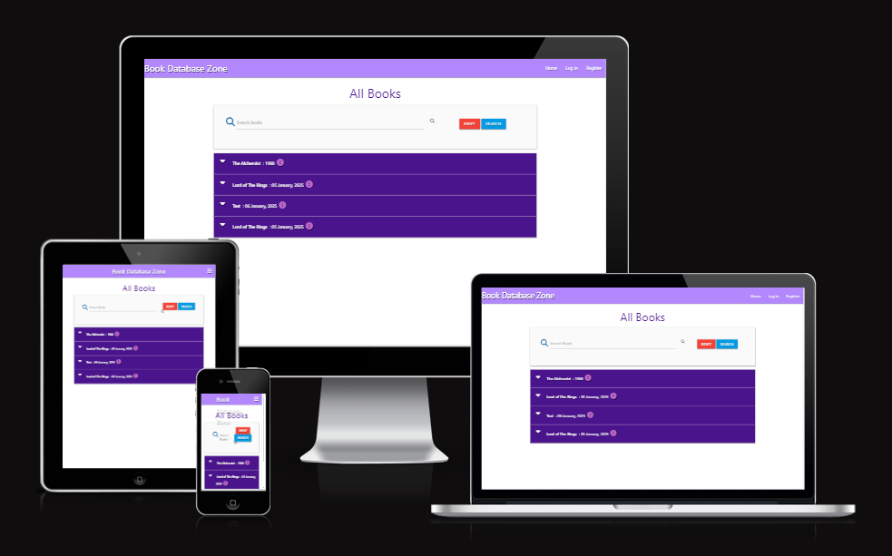
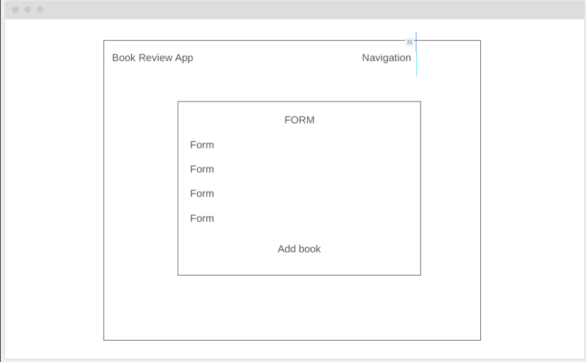
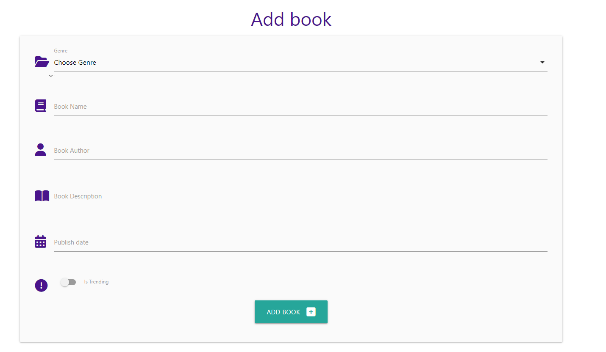
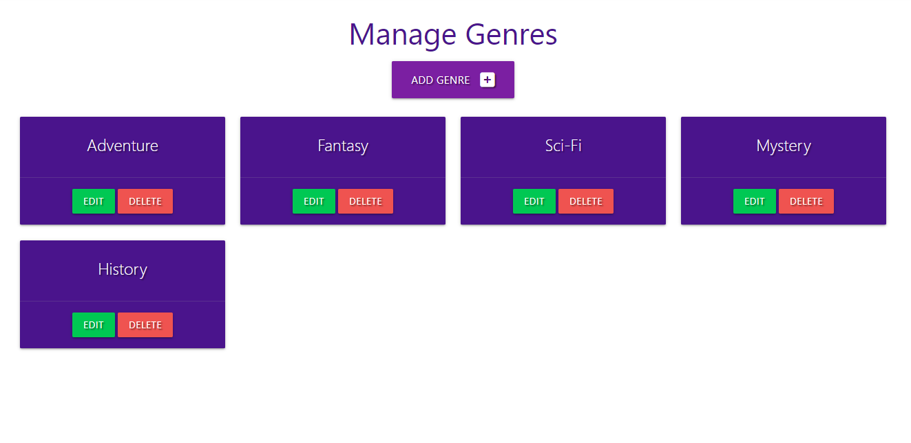
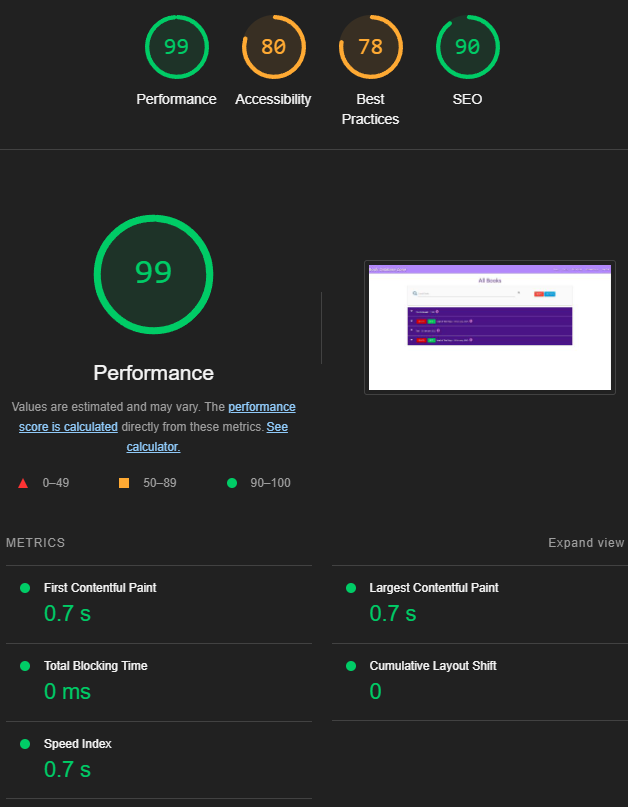
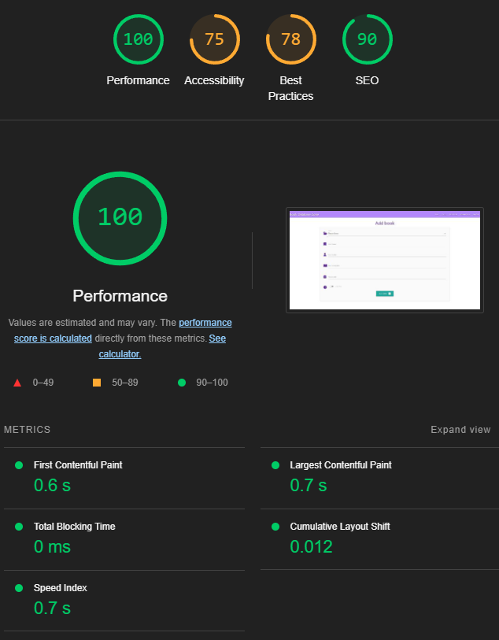
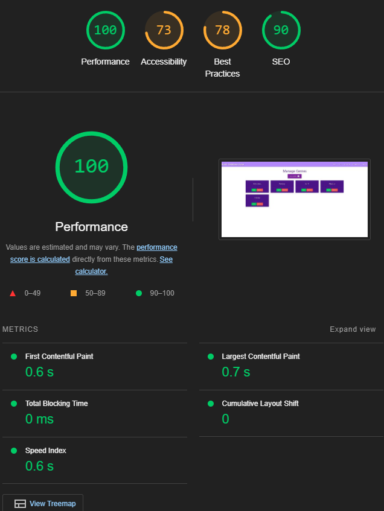
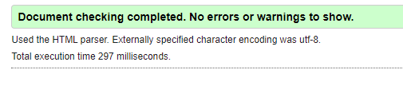
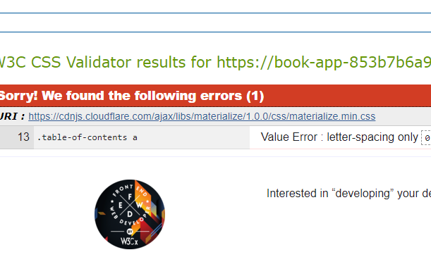

# Book Database Zone
## A website built to store your favourite books in a database.
## - Ramil Jose Tyrone Tuazon

## [Live site](https://book-app-853b7b6a9261.herokuapp.com/add_books)

## [Repository](https://github.com/Ramil96/book_app)

## Table of contents

1. [UX](#ux)
2. [Features](#features)
3. [Future features](#future-features)
4. [Technology used](#technology-used)
5. [Testing](#testing)
6. [Bugs](#bugs)
7. [Deployment](#deployment)
8. [Credits](#credits)
9. [Content](content)
10. [Acknowledgements](#acknowledgements)

## UX

### Pre-project planning
> When embarking on this project, I wanted to create a website that helps the user add books to a database website. I wanted this project to have a simplistic feel so easy navigation was necessary and the use of simple colours like purple green and red.

## UX Design
> The objective of my UX design strategy is to create a visually appealing, user-friendly interface for the book database application, prioritizing ease of navigation and accessibility. The design aligns with the purple color theme and the grid-based layout, ensuring simplicity and functionality.

The primary color for the application is purple, which conveys calmness. Purple is used for key elements such as buttons and active links. To complement this, white is used as secondary colors for backgrounds to enhance readability and create contrast.

Navigation is designed to be intuitive. A sticky top navigation bar is accessible from any part of the site and includes tabs for Home, Books, Genres, Add Book and Login and register functionality and navigation.

The design emphasizes simplicity and minimalism. Overcrowding is avoided by using whitespace effectively to separate content and guide the user's focus. Calls to action, such as "Add book" are kept prominent and minimal for a streamlined experience.

### Strategy Plane
---
To determine the best approach to this project, I began by identifying and understanding both user and business needs. By focusing on these needs, I could ensure that the website would be functional, user-friendly, and aligned with simplistic book-database application goals.

## User Stories
### User
> As a user I want to be able to add a genre to make sure they fit the desired book I wanted to add.

> As a user I want to be able to be able to see other books.

> As a user I want to be able to edit and delete my added book.

> As a user I want to be able to register and login.

### Business Owner
> As the site owner I want to be able to showcase my simplistic style to users.

> As the site owner I want users to navigate the site easily.

> As the site owner I want to provide a place for my users to edit and delete their own books.

## Scope Plane
> The website should have a navigation menu that is consistent across all pages and devices.

> The website should give users a variety of different options for CRUD functionality.

> The website should make it easy for users to navigate.

## Structure Plane
> To achieve the goals of the above the website will inclide login functionality to make use of all the database functions which offer full crud functionality.

#### Home Page
> Navigation with links consistent across all pages.

> Books will be displayed on the home page as well as full navigation to all other pages.

#### Add Book
> This page will give the user the ability to add books rate them and add a description of the book.

#### Genres
> This page will give the user the ability to add genres to fit the specific books.

### Home Page desktop Wireframe

> The design flow of this website is meant to showcase a minimal design.

## Surface Plane

### Color

> I decided that the best approach to this website was a structured yet minimalistic design to bring light to the most important navigation links at the top of the page to influence direct access and information regarding ease of access functionaity for the use of CRUD functionality for this book application.

> The decision I took in terms of which colors were to be used were
> - #purple - Materialize green

### Typography 
> The font's chosen for this project were 
- Default

> The reason I used this font were to keep the text simple and easy to read with no distractions.

## Features

### books.html

#### Header Navigation Features

> Navigation Bar and header developed using materialize.

#### Add book 

> I wanted to create a simple way for users to add books to the database.

#### Genres

> This page is for genre creation and gives the user the ability to view books in specific genre tabs through clickable links.

## Future Features

### Home page
> I would like to add functionality to give users the ability to leave reviews.

## Technology Used 

#### HTML
> I used HTML to structure my project.

#### CSS and materialize
> I used CSS to style my project and adjust the layout of certain elements on my website.

## Testing
> Testing on this project was done manually by me by myself and family members to determine the functionality of the site with both usability and responsiveness to make sure it is easily usable by a new user.

#### Testing links and form

| Test                                                         | Outcome |
|--------------------------------------------------------------|---------|
| All links on Navigation lead to their correct pages.         | Pass    |
| Defensive programming when trying to deleted added book.     | Pass    |
| Book displayed when added.                                   | Pass    |

#### Testing responsiveness

| Test                                                         | Outcome |
|--------------------------------------------------------------|---------|
| Home page, about, prices, contact us displays correctly on screens larger than 950px  | Pass    |
| Home page, about, prices, contact us displays correctly on screens smaller than 950px | Pass    |

### User testing
#### User testing challenge
> 5 users are given some basic tasks prior to visiting web page and the results totaled to give result (20% per successful user result.)

| Test                                                         | Outcome |
|--------------------------------------------------------------|---------|
| Upon arrival to website please navigate to where you would expect to find a review form.  | 100%    |
| Please navigate to add a book.                                                            | 100%    |
| Please fill in the add book form.                                                         | 100%    |
| Please navigate to add a review.                                                          | 100%    |
| Please add a genre as admin.                                                              | 100%    |

#### User responsive testing
> 5 users were asked to view the website on their mobile devices and/or tablets to provide any feedback on errors or page overlapping issues.

| Test                                                         | Result |
|--------------------------------------------------------------|---------|
| Issues Reported         | None    |

## Google Lighthouse Testing 
### books

### add book

### genres

## HTML Validation

### add_books.html

#### Result: No Errors

### add_book.html

#### Result: No Errors

### genres.html

#### Result: No Errors

## CSS Validation 

#### Result: No Errors for actual css although the error comes form materialize library and not my code.

## Deployment
> To deploy the project I followed the steps on the heroku part of the project material. [here](https://github.com/Ramil96/book_app)

## Credits

## Content and Resources 

### w3 schools
> Used for general help for HTML AND CSS syntax.

### materialize
> Used for help regarding the responsive side of development.

### stack overflow 
> For help with general quiries in regards to CSS, HTML and python.

### Code Institute 
> Project created in line with course content and within project 3 scope.

## Acknowledgements 
### Rory Patrick
> My mentor who provided me with constructive feedback and positive reinforcement where applicable.